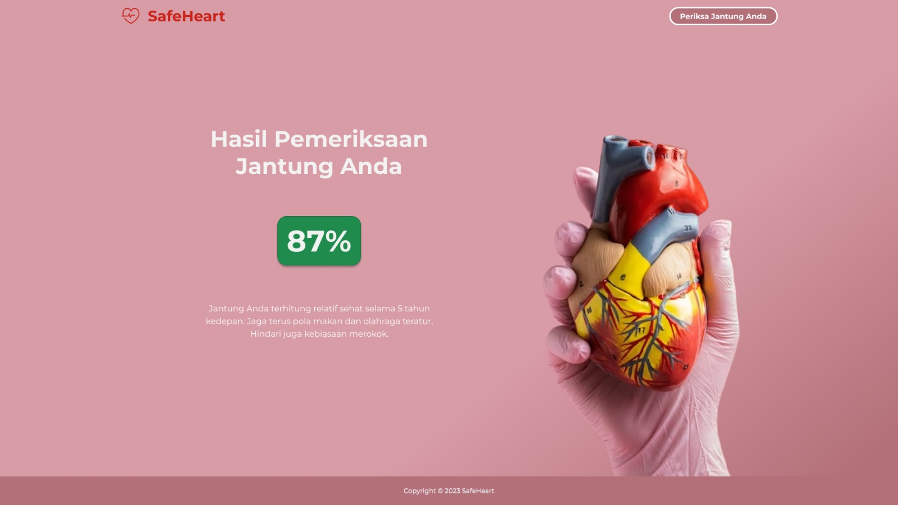

# SafeHeart Project
Welcome to SafeHeart Project from CC23-PC784 Team

## Background Story:
We created SafeHeart with the intention of bringing solutions to heart disease risk with symptoms or without symptom problems in Indonesia. SafeHeart offers a classification feature for heart disease risk categories, with individual classification categories into high, medium, or low-risk categories, based on age, gender, blood pressure, cholesterol levels, BMI, smoking status, and other relevant health factors. With these features, SafeHeart needs machine learning assistance using a classification model that can accurately predict the risk of heart disease based on the given health parameters.

## Machine Learning Team
Has several responsibility such as:
1. Collecting and Preprocessing dataset
2. Build a Model
3. Testing model

## Cloud Computing Team
Has several responsibility such as:
Designing UI and front end of the web

## Contributor
1. M017DSY2484 - [Ghina Fujiawati Jaelani](https://www.linkedin.com/in/) - Institut Teknologi Bandung - Machine Learning
2. M137DSX0540 - [Vallen Adithya Rekhsana](https://www.linkedin.com/in/vallen-adithya-rekhsana-a5734b193/) - Universitas Andalas - Machine Learning
3. M360DSY0046 - [Hasna Nadhiva Muninggar](https://www.linkedin.com/in/) - Universitas Telkom - Machine Learning
4. C151DKY4367 - [Izzah Firzanah](https://www.linkedin.com/in/izzah-firzanah-024951215/) - Universitas Brawijaya - Cloud Computing
5. C304DSX3668 - [Raihan Darmawan Pringgodigdo](https://www.linkedin.com/in/raihan-darmawan-pringgodigdo-14970021a) - Universitas Pembangunan Nasional Veteran Jakarta - Cloud Computing
